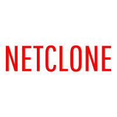

# Vue 3 + Vite 

This template should help get you started developing with Vue 3 in Vite. The template uses Vue 3 `<script setup>` SFCs, check out the [script setup docs](https://v3.vuejs.org/api/sfc-script-setup.html#sfc-script-setup) to learn more.

## Recommended IDE Setup

- [VSCode](https://code.visualstudio.com/) + [Volar](https://marketplace.visualstudio.com/items?itemName=johnsoncodehk.volar) 
 
 
 <!-- PROJECT LOGO -->   
<br />
<p align="center">
  <a href="https://github.com/ChristianPredoianu/netflix-clone-v2">
    
  </a> 

  <h3 align="center">Netflix clone</h3>
   
  <p align="center">
   Netflix Clone
    <br />
    <a href="https://github.com/ChristianPredoianu/netflix-clone-v2"><strong>Explore the docs »</strong></a>
    <br />
    <br />
    <a href="https://christianpredoianu.com/">View Demo</a>
    ·
    <a href="https://github.com/ChristianPredoianu/netflix-clone-v2/issues">Report Bug</a>
    ·  
   
  </p>
</p>

 

<!-- TABLE OF CONTENTS -->
<details open="open">
  <summary><h2 style="display: inline-block">Table of Contents</h2></summary>
  <ol>
    <li>
      <a href="#about-the-project">About The Project</a>
      <ul>
        <li><a href="#built-with">Built With</a></li>
      </ul>
    </li>
    <li>
      <a href="#getting-started">Getting Started</a>
      <ul>
        <li><a href="#prerequisites">Prerequisites</a></li>
        <li><a href="#installation">Installation</a></li>
      </ul>
    </li>
    <li><a href="#usage">Usage</a></li>
    <li><a href="#license">License</a></li>
    <li><a href="#contact">Contact</a></li>
    <li><a href="#acknowledgements">Acknowledgements</a></li>
  </ol>
</details>


<!-- ABOUT THE PROJECT -->
## About The Project

A Netflix clone made with Vue 3 + Vite + Firebase to mimic Netflix functionality.

### Built With

* [Vue.js](https://vuejs.org/)
* [Vite](https://vitejs.dev/)
* [Vuex](https://vuex.vuejs.org/)
* [Vue Router](https://router.vuejs.org/)
* [HTML5](https://developer.mozilla.org/en-US/docs/Glossary/HTML5)
* [CSS3](https://developer.mozilla.org/en-US/docs/Web/CSS)
* [Sass](https://sass-lang.com/)
* [Firebase](https://firebase.google.com/?gclid=CjwKCAjwo_KXBhAaEiwA2RZ8hI3FPK5630oR5OFUcmh5Y0_KPSDC28YPeujdLrVpk85-YyXq9Z4HLRoCE3AQAvD_BwE&gclsrc=aw.ds)


<!-- GETTING STARTED -->
## Getting Started

To get a local copy up and running follow these simple steps.

### Prerequisites

* npm
  ```sh
  npm install npm@latest -g
  ```

### Installation

1. Clone the repo
   ```sh
   git clone https://github.com/ChristianPredoianu/netflix-clone-v2
   ```
2. Install NPM packages
   ```sh
   npm install
   ``` 
3. Serve with hot reload at localhost:1234
   ```sh
    npm run dev
   ``` 
5. Build for production 
   ```sh
    npm run build
   
   ```

   

   
   
   
   
   
<!-- USAGE EXAMPLES -->
## Usage


To start using Netclone you have two options:

1.1 Sign in to Netclone with an existing account for demo purposes https://netclonevue.netlify.app/signIn:
Username: test@test.com
Password: testingnetclone => choose an existing profile

1.2 Signup to Netclone with a dummy email made up by you. E.g (john@whatever.com) It doesn't need to be a valid email. And choose a password. => Add a profile and continue with the selected profile.

 


<!-- LICENSE -->
## License

Distributed under the MIT License. See `LICENSE` for more information.


<!-- CONTACT -->
## Contact

Christian Predoianu - [@linkedin](https://se.linkedin.com/in/christian-predoianu-369218157) - christianpredoianu@yahoo.com

Project Link: [https://github.com/ChristianPredoianu/netflix-clone-v2](https://github.com/ChristianPredoianu/netflix-clone-v2)


<!-- ACKNOWLEDGEMENTS --> 
## Acknowledgements
* [Google Fonts](https://fonts.google.com/)
* [Swiper.js](https://swiperjs.com/)
* [Font-Awesome](https://fontawesome.com/)


<!-- MARKDOWN LINKS & IMAGES -->
<!-- https://www.markdownguide.org/basic-syntax/#reference-style-links -->
[contributors-shield]: https://img.shields.io/github/contributors/github_username/repo.svg?style=for-the-badge
[contributors-url]: https://github.com/github_username/repo/graphs/contributors
[forks-shield]: https://img.shields.io/github/forks/github_username/repo.svg?style=for-the-badge
[forks-url]: https://github.com/github_username/repo/network/members
[stars-shield]: https://img.shields.io/github/stars/github_username/repo.svg?style=for-the-badge
[stars-url]: https://github.com/github_username/repo/stargazers
[issues-shield]: https://img.shields.io/github/issues/github_username/repo.svg?style=for-the-badge
[issues-url]: https://github.com/github_username/repo/issues
[license-shield]: https://img.shields.io/github/license/github_username/repo.svg?style=for-the-badge 
[license-url]: https://github.com/github_username/repo/blob/master/LICENSE.txt 
[linkedin-shield]: https://img.shields.io/badge/-LinkedIn-black.svg?style=for-the-badge&logo=linkedin&colorB=555
[linkedin-url]: https://linkedin.com/in/github_username    
 
 
 
